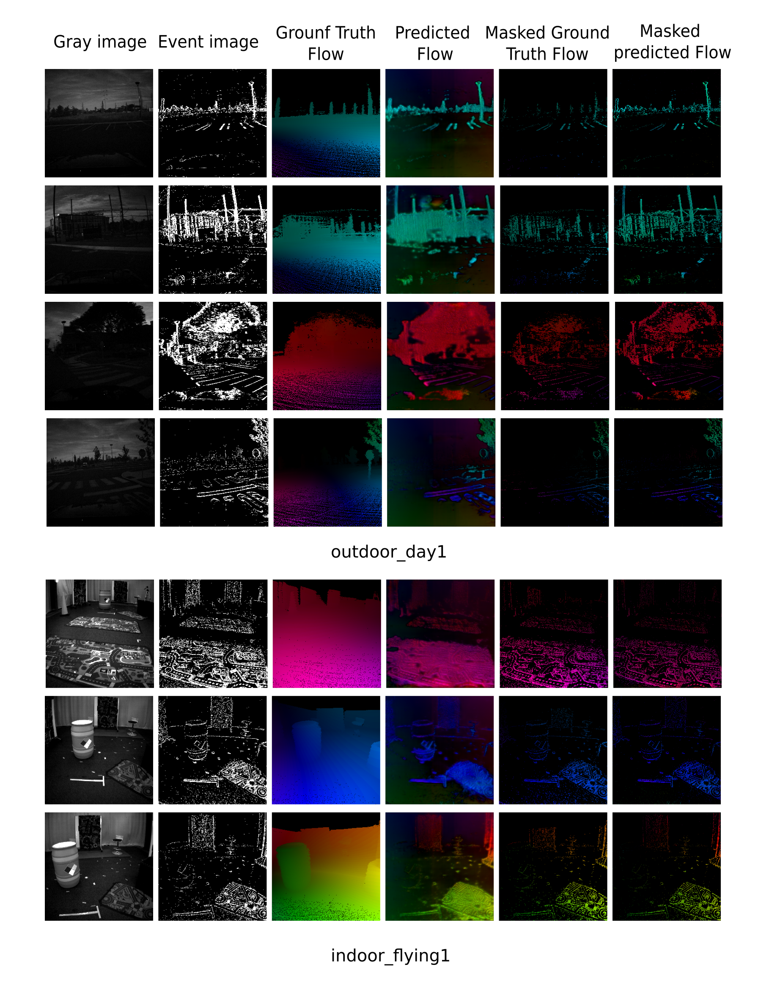

# 3D-FlowNet: Event-based optical flow estimation with 3D representation


  

This repository contains the Minimal code for running inference associated with 3D-FlowNet: Event-based optical flow estimation with 3D representation
This code is tested with the Python 3.9 and Pytorch 1.10.0. The training part will be released after paper acceptance.

## Introduction
Event-based cameras can overpass frame-based cameras limitations for important tasks such as high-speed motion detection during self-driving cars navigation in low illumination conditions. The event cameras' high temporal resolution and high dynamic range, allow them to work in fast motion and extreme light scenarios. However, conventional computer vision methods, such as Deep Neural Networks, are not well adapted to work with event data as they are asynchronous and discrete. Moreover, the traditional 2D-encoding representation methods for event data, sacrifice the time resolution. In this paper, we first improve the 2D-encoding representation by expanding it into three dimensions to better preserve the temporal distribution of the events. We then propose 3D-FlowNet, a novel network architecture that can process the 3D input representation and output optical flow estimations according to the new encoding methods. A self-supervised training strategy is adopted to compensate the lack of labeled datasets for the event-based camera. The proposed network is trained and evaluated with the Multi-Vehicle Stereo Event Camera (MVSEC) dataset. This paper is accepted by the IV 2022 confernece.[__**here**__](https://arxiv.org/abs/2201.12265).


## Dataset

The MVSEC dataset can be found [__**here**__](https://daniilidis-group.github.io/mvsec/download/#hdf5-files).

Download the ```*_data.hdf5``` and ```*_gt.hdf5``` files from the above link in their respective folders inside the [/datasets](datasets).

Example: Download ```indoor_flying1_data.hdf5``` and ```indoor_flying1_gt.hdf5``` files into [/datasets/indoor_flying1](datasets/indoor_flying1) folder.

Ground truth flow can be generateed with:
```python split_encoding_gt.py --save-dir ../datasets --save-env indoor_flying1 --data-path ../datasets/indoor_flying1/indoor_flying1_data.hdf5 --gt-path ../datasets/indoor_flying1/indoor_flying1_gt.hdf5```

Unpack the hdf5 data files with [/encoding/split_coding.py](encoding/split_coding.py).
```python split_encoding.py --save-dir ../datasets --save-env indoor_flying1 --data-path ../datasets/indoor_flying1/indoor_flying1_data.hdf5```


## Pre-trained Model

The pretrained model can be found in [/pretrain](pretrain/) folder. Note, pretrained models are trained only on outdoor_day2 dataset as described in the paper.


## Testing with flow visualization

The basic syntax is:

 ```python3 main_3d_flow.py -e --render --pretrained='checkpoint_path'``` 

## Acknowledgments

Parts of this code were derived from [daniilidis-group/EV-FlowNet](https://github.com/daniilidis-group/EV-FlowNet) and [chan8972/Spike-FlowNet](https://github.com/chan8972/Spike-FlowNet).
